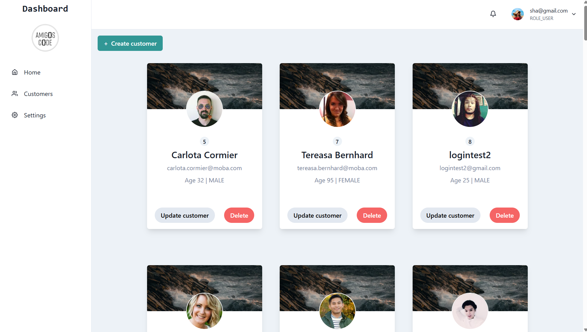
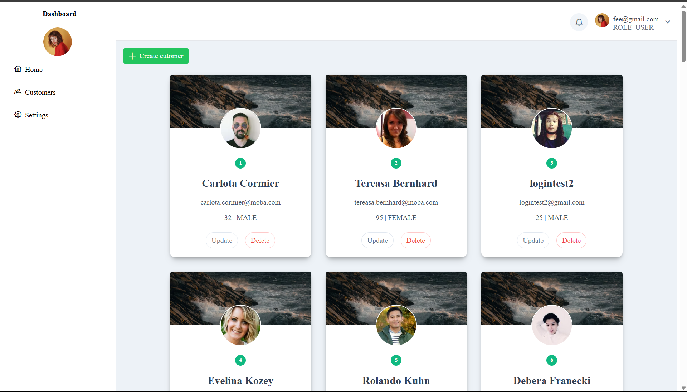
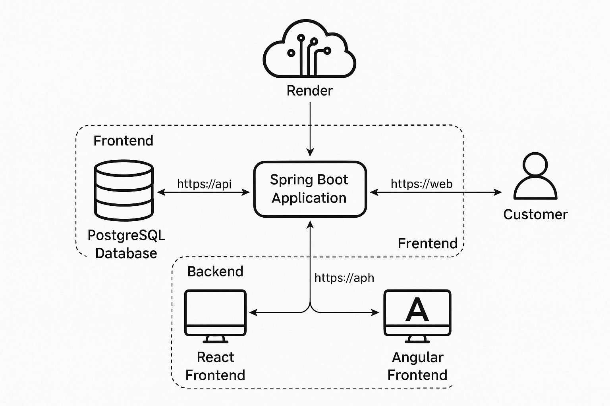
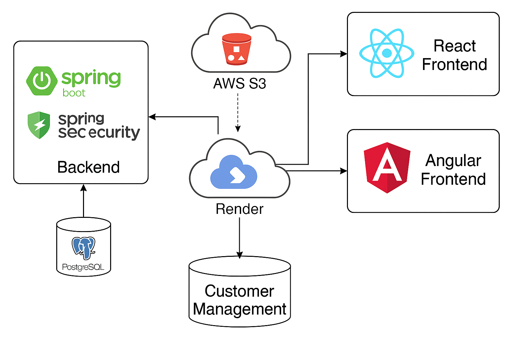

# Customer Management Full-Stack Application


A full-stack customer management platform built with **Spring Boot (Java)** for the backend and two separate frontend implementations using **React** and **Angular**.  
The project demonstrates modern development workflows, security, CI/CD, and production deployment.

---

## Live Demo

- **React Frontend**: [Live React App](https://customer-management-react.onrender.com/)
- **Angular Frontend**: [Live Angular App](https://spring-boot-fullstack-h1wd.onrender.com)
- **Backend API**: [Live API](https://customer-management-api-3y8d.onrender.com/)

---

## Features

- **User Authentication & Authorization**
    - JWT-based authentication with Spring Security 6.
    - Role-based access control.
    - Stateless session management.

- **Customer Management**
    - Create, Read, Update, Delete (CRUD) operations for customers.
    - Upload and manage customer profile images (AWS S3 ready).

- **Dual Frontend Implementations**
    - **React** frontend for rapid development with Chakra UI (then migrated to ShadCN).
    - **Angular** frontend with PrimeNG UI components.

- **Database**
    - PostgreSQL as the primary data store.
    - Flyway for database migration and schema versioning.

- **CI/CD**
    - GitHub Actions pipelines for automated builds, tests, and deployments.
    - Slack notifications integrated with real-time deployment status updates.
    - Docker images pushed to Docker Hub for versioned releases.

- **Cloud Deployment**
    - Backend & React frontend deployed on **Render** (Docker & GitHub integration).
    - Angular SSR app deployed on Render using production build mode.
    - AWS S3 integration configured for static file and image storage.

---

## Tech Stack

- **Backend**: Spring Boot 3, Spring Security 6, JJWT (JWT), Flyway, PostgreSQL, JDBC, JPA, Lists
- **Frontend**: React (Vite + ShadCN), Angular (Standalone Components + PrimeNG)
- **Testing**: Postman (API), Spring Boot Unit & Integration tests
- **CI/CD**: GitHub Actions, Slack Notifications, Docker Hub, Render Deployment
- **Other Tools**: Docker, AWS S3, Maven, GitHub Secrets

---

## Testing & Quality Assurance

- **Postman** used extensively for API endpoint testing (authentication, customer CRUD).
- **Unit Tests & Integration Tests** implemented in the Spring Boot backend.
- Automated tests run as part of **GitHub Actions CI** pipeline.
- Manual end-to-end testing performed for both Angular and React frontends.
- Verified CORS handling, JWT-based security, and role-based access flows.
- Final deployment verified on Render for production readiness.

---

## CI/CD Workflow

1. **Code Commit** → triggers GitHub Actions pipeline.
2. **Build & Test** → Maven builds backend & runs tests, Node builds frontends.
3. **Docker Build & Push** → Images published to Docker Hub with `latest` and timestamped tags.
4. **Deployment** → Render deploy hook triggers live deployment.
5. **Slack Notification** → build and deploy status sent to a team Slack channel.

---

# How to Run Locally

## Backend
```bash
cd backend
mvn spring-boot:run
```
---
## React Frontend

```bash
cd frontend/react
npm install
npm run dev
```
## Angular Frontend
```bash
cd frontend/angular
npm install
npm run dev
```

## Run with Docker Compose
```bash
docker-compose up --build
```

## Deployment
Render hosts both frontend and backend (Docker-based & GitHub source-based).
Configured for AWS S3 static hosting readiness and image upload integration.
Environment variables (e.g., SPRING_DATASOURCE_URL, VITE_API_BASE_URL) are used for flexible deployment.

## Screenshots

### React


### Angular


### Database and System Design




## Future Improvements
Complete integration of AWS S3 for production image uploads.
Add automated E2E tests for Angular & React frontends.
Extend CI/CD to include security and performance scanning.

## Author
### Muhammed Bakor

LinkedIn

GitHub

## License
This project is licensed under the MIT License.

